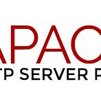

## Deliverable 1 Submission

## Basic Terminology

### What is a web server?
* Web server is a computer software and underlying hardware that accepts request via HTTP or its secure variant HTTPS.

### What is Apache?

* Apache is a server that is widely-used in the world. It provides many powerful features including dynamically loadable modules, robust media support, and extensive integration with other popular software.

### What are some different web server applications?
| Application Name | License                                 | Project's Website                    |
| ---------------- |---------------------------------------- | ------------------------------------ |
| Example 1        | Apache                                  | [Example 1](https://www.apache.org/) |
| Example 2        | Microsoft Internet Information Services | [Example 2](https://www.iis.net/)    |
| Example 3        | Nginx                                   | [Example 3](https://www.nginx.com/)  |

### What is virtualization?

* The act of creating a virtual version of something at the same abstraction level,including virtual computer hardware platforms, storage devices, and computer network resources.

### What is a virtual machine?

* A computer system created using software on one physical computer in order to emulate the functionality of another separate physical computer.

### What is Ubuntu Server?

* A part of the larger set of Ubuntu products and operating system developed by Canonical Ltd. It is a specific addition that differs a little bit from Ubuntu desktop, in order to facilitate installation on servers.

### What is a firewall?

* A network security system designed to block unauthorized access while permitting outward communication.

### What is SSH?

* Is a network protocol that gives users, particularly system administrators, a secure way to access a computer over an unsecured network.