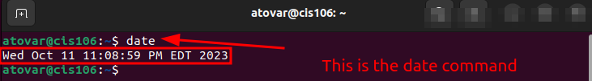
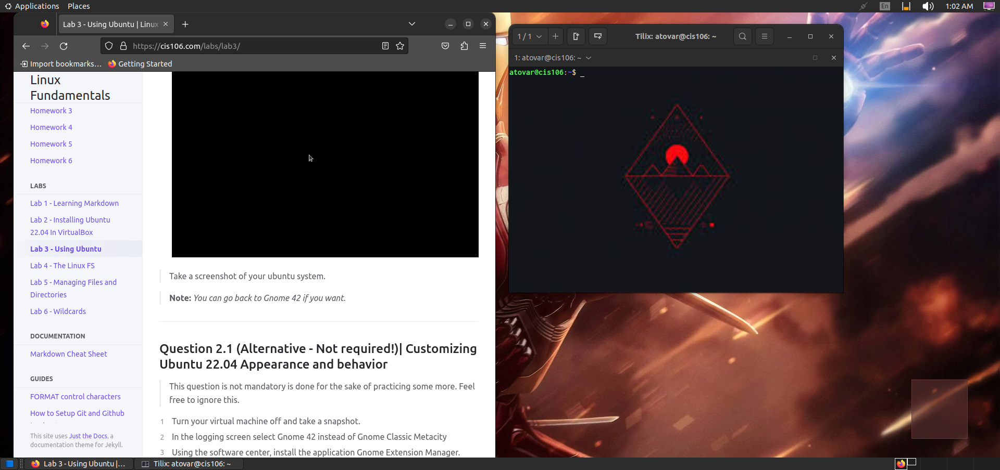

# Lab 3 Submission

## Question 1

## Question 2

## Question 3
| Program purpose     | Package Name     | Version                            |
| ------------------- | ---------------- | ---------------------------------- |
| Play a tetris game  | blockattack      | 2.7.0-1                            |
| Play a video file   | dragonplayer     | 4:21.12.3-0ubuntu1                 |
| Browse the internet | epiphany-browser | 42.4-0ubuntu1                      |
| Read your email     | geary            | 40.0-2                             |
| Play music          | clementine       | 1.4.0~rc1+git347-gfc4cb6fc7+dfsg-2 |

## Question 4
| command | what it does                                                         |
| ------- | -------------------------------------------------------------------- |
| echo    | nothing happen                                                       |
| fortune | Don't tell any big lies today.  Small ones can be just as effective. |
| cowsay  | No ideo on how to end it                                             |
| lolcat  | highlight what I type when entered                                   |
| figlet  | Makes what I enter big                                               |
| toilet  | Makes what I enter big but by using from the keyboard                |
| rig     | Clifford Hill 
            934 Plymth Terr
            Dallas, TX  75260
            (214) xxx-xxxx |