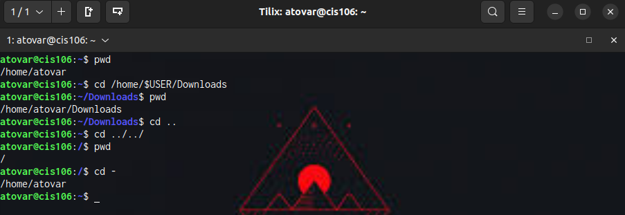
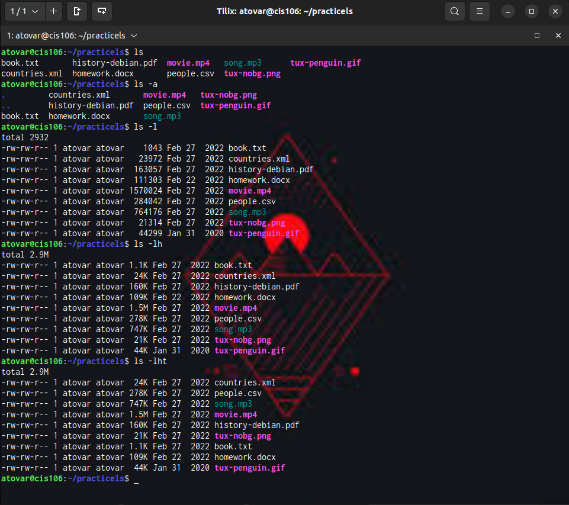
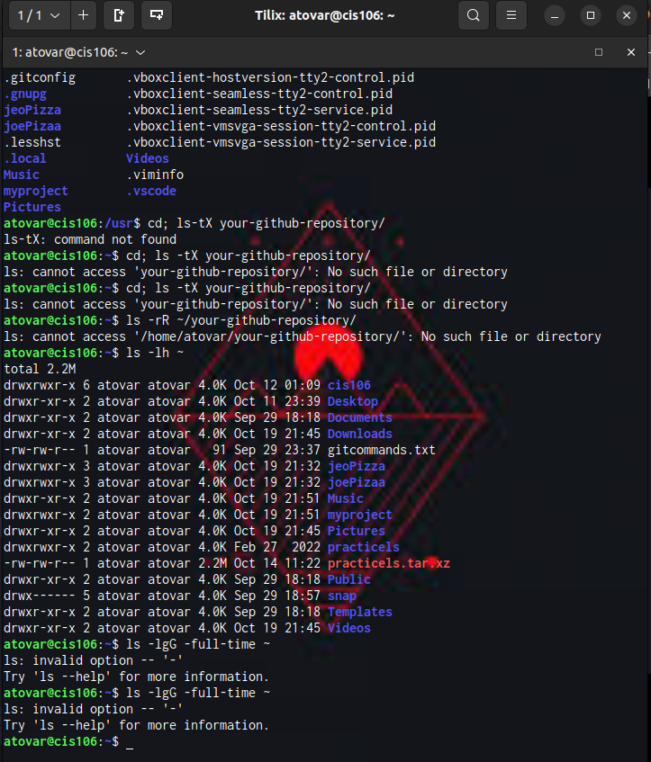
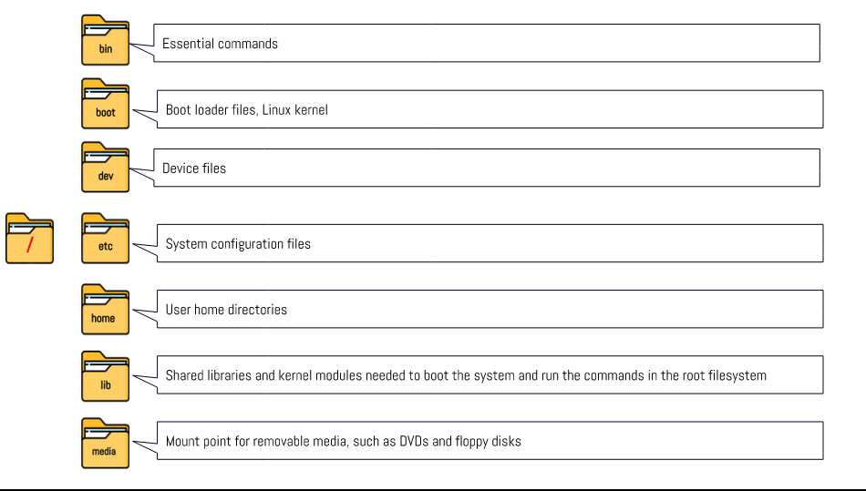
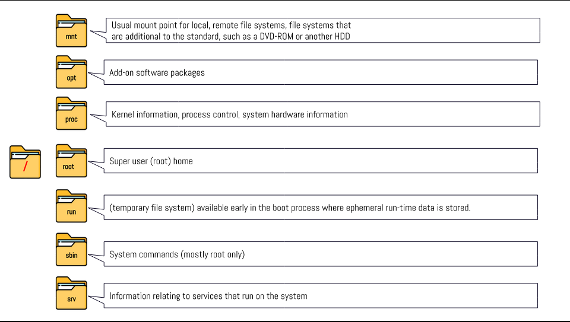
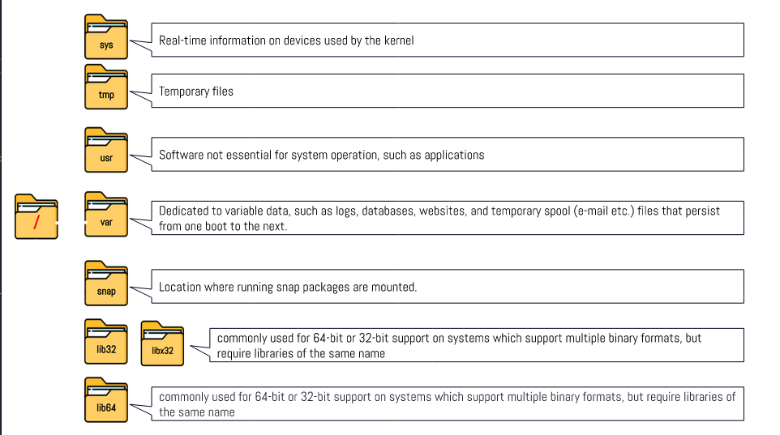

# Week Report 4

## PRACTICE FROM THE PRESENTATION THE LINUX FILE SYSTEM
### Practice 1
 

### Practice 2
 
 

### Practice 3
 

## THE LINUX FILE SYSTEM DIRECTORIES AND THEIR PURPOSE

 
 
 

## ALL THE COMMANDS FOR NAVIGATING THE FILESYSTEM

| Command | What it does                                      | Syntax | Example |
| ------- | ------------------------------------------------- | ------ | ------- |
| pwd     | prints current directory                          | pwd    | 'pwd'   |
| cd      | changes the current working directory             | cd     | 'cd'    |
| ls      | displaying all the files inside a given directory | ls     | 'ls'    |

## Basic terminology
* **File system:** The way files are stored and organized.
* **Current directory:** The directory where you are at the moment.
* **parent directory:** Moving backwards to the previous directory.
* **the difference between YOUR HOME directory and THE HOME directory:** When you open your terminal emulator, your current working directory is your home directory. When you open the file manager, your current working directory is the home directory.
* **pathname:** Which indicates the location of the file in the filesystem (like an address).
* **relative path:** The location of a file starting from the current working directory or a directory that us located inside the current working directory.
* **absolute path:** The location of a file starting a the root of the file system.