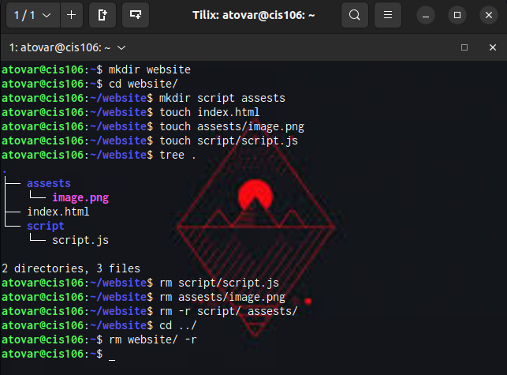
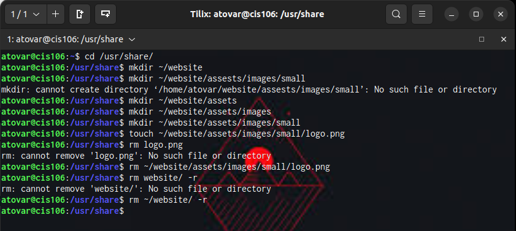
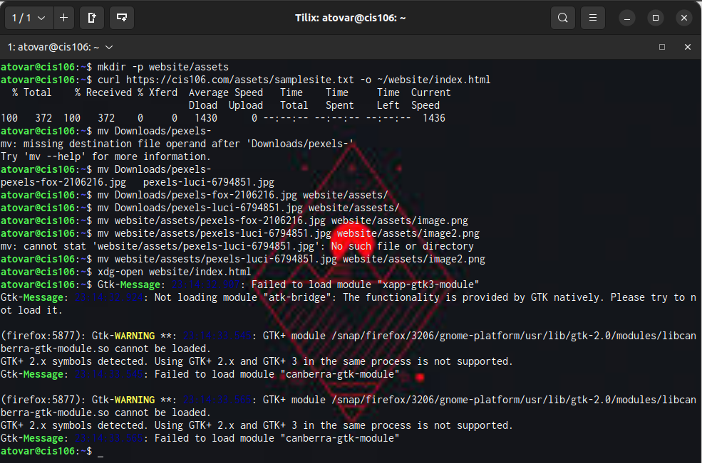
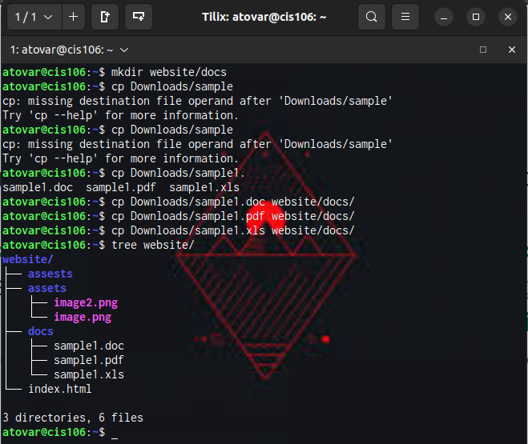

# Week Report 5

## Answer to questions:

* **What are Command Options?**
Command option  modifies the operation of a command.
* **What are Command Arguments?**
Command arguments are indicated after the name of the program in the framework's order line.
* **Which command is used for creating directories? Provide at least 3 examples.**
The command is mkdir.
* Example 1: 
  * Create a directory: 'mkdir apple'
* Example: 2
  * Create multiple directories at different places: 'mkdir movies ~/Downloads/games ~/Documents/hmw'
* Example: 3
  * Creating multiple directories at once: 'pizza1 pizza2 pizza3 pizza4'
* **What does the touch command do? Provide at least 3 examples.**
It updates that last modified date on the given files.
* Example 1:
  * Create a new file: 'touch file1'
* Example 2:
  * Crate multiple files: 'touch file1 file2 file3'
* Example 3:
  * Change the date: 'touch -d'
* **How do you remove a file? Provide an example.**
By using the command 'rm' then the name of the file you want to remove. An example would be 'rm file1'.
* **How do you remove a directory and can you remove non-empty directories in Linux? Provide an example**
Use the 'rmdir' to remove a directory. Yes you can by typing 'rm -r'.
* **Explain the mv and cp command. Provide at least 2 examples of each**
The mv command is use to move files or directories from one place to another for example 'mv file1 ~/Downloads/'.The cp command is use to copy files or directories
for example 'cp hello'.

Practice 1
 
Practice 2
 
Practice 3
 
Practice 4
 