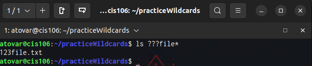
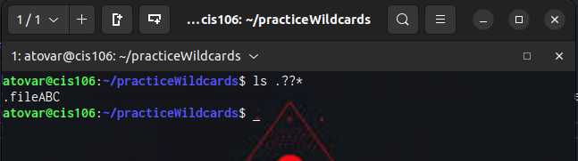
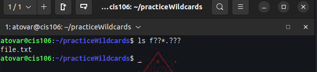
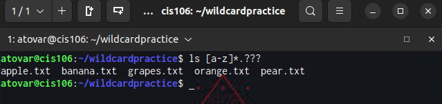
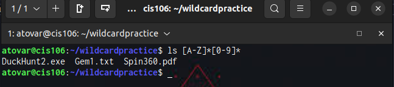
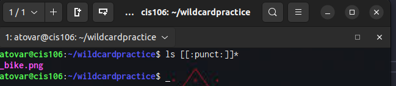
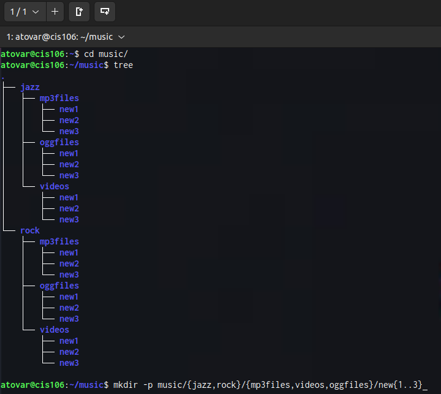
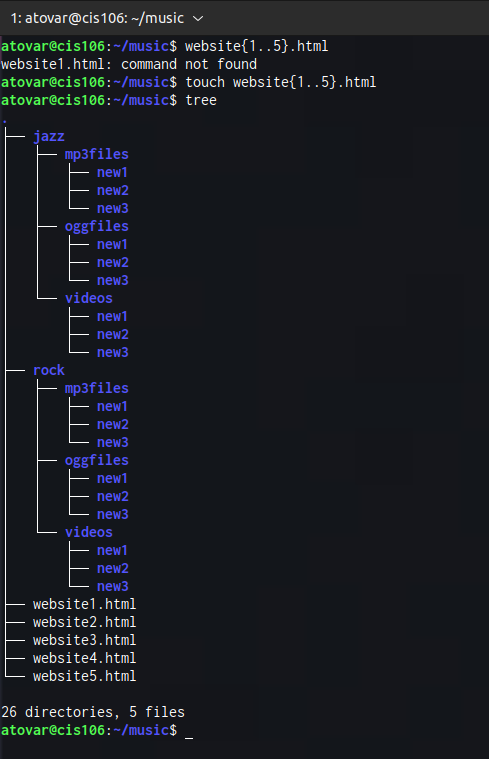
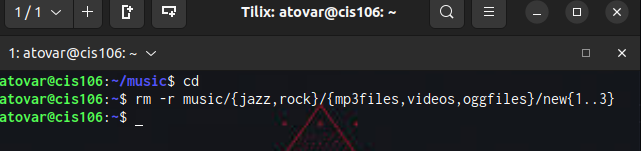

# Week Report 6

## Wildcards

### * Wildcard
The * wildcard matches from 0 to any number of characters.
* Example:
  * List all the text file in a directory
    * 'ls *.txt'
  * List all the files that start with the word file
    * 'ls file*'
  * Copy all the mp4 files
    * 'cp Downloads/*.mp4 ~/Videos/Movies/'

### ? Wildcard
The ? wildcard matches a single character
* Examples:
  * List all the files that have 3 characters and are followed by the word file in the name

  * List all the files that are hidden.

  * List all the files that start with letter f

### [] Wildcard
The [] wildcard matches a single character in a range
* Examples:
  * List all the files that start with a lowercase letter and have a 3 letter file extension

  * List all the files that start with an uppercase character and have a number in the name

  * List all the file that start with a punctuation sign

### Brace Expansion
{} is not a wildcard but another feature of bash that allows you to generate arbitrary strings to use with commands

## Practice
* Examples:
  * To create a whole directory structure in a single command

  * To create a N number of files use

  * Remove multiple files in a single directory
