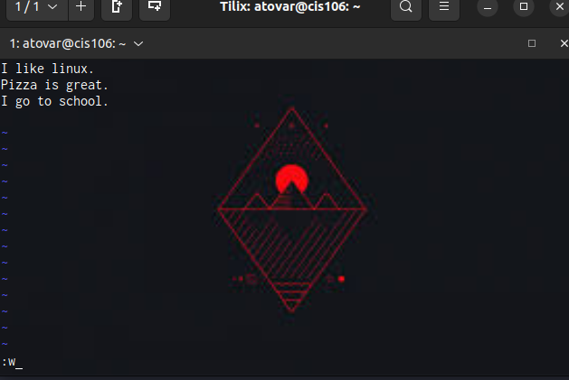

# Week Report 8

## Question

## Question 1
* The vi command_line text editor is included in all POSIX compliant operating system

## Question 2
* Nano is efficient and easy way to edit files on the fly through terminal

## Question 3
* Type 'vim' will start VIM and to quit press 'esc' on the keyboard and type ':qa!'
  * Insert mode is used for writing text
  * Normal mode is used for controlling text
  * Command mode is used for entering VIM commands
  * Visual mode is used for navigating and controlling selections of text
  * Select mode is used for its similarity to visual mode
  * Ex-mode is used for its similarity to command_line mode but optimized for batch processing
* 
* 
* You delete text by typing 'dw'.

## Question 10
